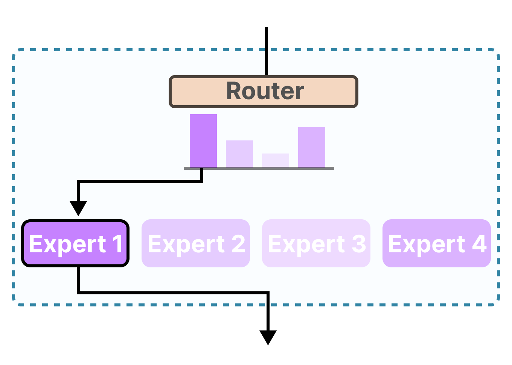

在做 LLM 的 RL post-training 时，我们常常默认一个前提：rollout 时模型采样到的行为，和训练时重新计算 log probability 的模型，是同一个 policy。只有这样，on-policy RL 的假设才成立，像 PPO、GRPO 这类方法里的 importance ratio、KL 约束、old policy reference 才是有意义的。

但现实并不是这样。

今天很多 RL 系统，采样侧会用 vLLM、SGLang、TensorRT-LLM 这类高吞吐推理引擎，而训练侧则用 FSDP、Megatron、DeepSpeed 之类的训练框架。两边的 kernel、数值精度、并行切分策略、batching 方式都不同。结果是：**同样的 token 序列，rollout engine 和 training engine 给出的 logits 并不相同。**

这就是所谓的 train-infer mismatch。因为 dense 模型的结构是连续的，所以影响比较小；单对于 MoE 模型来说，由于 Expert Router 的存在，会导致严重的训练不稳定。

## 什么叫训推一致

训推一致的一个直接定义是：

$$
\pi_\theta^{rollout}(y_t \mid x, y_{<t}) = \pi_\theta^{train}(y_t \mid x, y_{<t})
$$

这里有三个关键前提：

1. 输入是同一个 prompt 和同一段前缀 token 序列
2. 比较的是 rollout 引擎和 train 引擎
3. 两边输出的 logits 或对应概率分布一致

如果同样的序列，进入训练引擎和推理引擎后得到的 logits 不同，那么训推就不一致。这个差异表面上只是“两个 logprob 不一样”，但在 RL 里它会直接污染梯度估计。

## 为什么会发生不一致

第一层是数值计算本身。GPU 浮点运算不是严格结合的，累加顺序一旦变化，结果就可能不同。虽然 LLM 前向并不总是依赖 atomic add，但只要 reduction 顺序、tile 切分方式、内存布局或 kernel 选择发生变化，就可能带来细微数值偏移。

第二层是系统级实现差异。即使单个 kernel 在固定输入上是 deterministic 的，整个 serving system 仍然可能不是 batch invariant 的。比如动态 batch size 不同，attention 在 decode 阶段可能选择不同的 split-KV 策略；不同的 batch shape 也可能让 compiler 选择不同的 tile 或 warp 划分。于是同一个请求，只因为旁边拼了不同数量的请求，最后就可能得到不同的 logits。

第三层是训练和推理栈的目标本来就不同。推理引擎追求的是 tokens/sec，会更积极地使用低精度、batch-variant kernel、speculative decoding 等优化；训练框架更关心梯度计算的稳定性和反向传播，因此往往保留更高精度或不同的实现路径。这种“优化目标不一致”，会自然演化成“行为分布不一致”。

## 为什么 MoE 上这个问题更严重

> 在相同的误差程度下，MoE 多了一个**放大误差的离散路由层。**

MoE 的核心结构是 router + experts。router 会根据当前 hidden state 选择少数几个 expert 参与计算。也就是说，MoE 不是所有参数都参与前向，而是先做一次路由决策，再按这个决策走不同的计算分支。

这会带来两个后果。

第一，router 对数值误差极度敏感。对于 dense 模型，训推之间哪怕 logits 有一点偏移，通常也只是 token 概率略微变化；而对 MoE 来说，哪怕 router score 只发生很小的扰动，也可能让 top-k expert 发生切换。一旦 expert 变了，后续整层 FFN 路径都变了。

第二，路径切换会让 RL 里的 off-policy 问题陡然恶化。采样时你是沿着 rollout engine 选中的 expert 路径生成数据，但训练时重算 old logprob 时，training engine 可能激活的是另一组 experts。于是你以为自己在做 on-policy correction，实际上是在拿一条路径上的样本，去估另一条路径下的概率。这会让 importance sampling ratio 变得不可靠，甚至完全失真。

所以在 MoE 模型里，训推不一致，直接导致了 KL 指标变差，还会引发一系列 cascading effect：

1. router 的微小误差会被离散路由放大
2. 不同 expert 激活会导致更严重的分布偏移
3. importance sampling 的估计方差和偏差都会迅速变坏
4. 最终表现为 reward、entropy、gradient norm、PPL 等指标出现尖峰甚至训练崩溃

## 这会怎样破坏 RL 训练

如果从 RL 的角度看，train-infer mismatch 的本质是：你用采样分布 $\mu$ 拿到了数据，但训练时优化的是另一个分布 $\pi$ 下的目标，而且这两个分布之间的差异并不小。

当这种差异存在时，问题通常分成两类：

1. **Bias**
训练得到的梯度不再指向真实优化目标，优化器会系统性地朝错误方向更新。

2. **Variance**
importance ratio 变得很大，梯度噪声暴涨。即便训练不立刻崩，也会被迫把学习率压得很低，训练几乎停滞。

这也是为什么很多系统里你会看到一种表面矛盾的现象：训练指标没有马上 explode，但 reward 上不去，或者一旦进入更长响应、更复杂 agent rollout、多轮 tool use 场景就开始不稳定。不是算法突然失效，而是 mismatch 被长序列和复杂状态分布放大了。

## 为什么普通 dense 模型影响相对较小

dense 模型当然也会有 mismatch，但它至少没有路由层这个离散放大器。

对 dense 模型来说，训推差异更多表现为：

1. 同一个 token 的概率有一些偏差
2. 序列越长，这些偏差沿着自回归链条累计
3. 重要性采样会变得越来越 noisy

对 MoE 模型来说，上面这些问题还会额外叠加：

1. router score 的微小误差
2. top-k experts 的切换
3. 整条计算路径变化
4. 训练侧与推理侧 logprob 出现更剧烈偏差

所以可以把它理解为：**dense 模型的 mismatch 更像是“概率连续漂移”，MoE 的 mismatch 更像是“概率漂移 + 计算图切换”。**

## 现在有哪些解决思路

从工程上看，主流方案大致分成三类。

## 1. 修基础设施，让训推尽量一致

第一条路线是最“硬核”的：直接对齐 training stack 和 inference stack，让两边在 kernel 层和系统层尽可能得到一致结果。

这类工作的核心关键词通常是 deterministic inference 和 batch-invariant kernels。它的目标不是“平均差不多”，而是同一个请求在不同 batch 条件下，仍然尽量得到相同结果。

典型思路包括：

1. 固定 reduction 顺序
2. 避免 batch size 改变时触发不同的 split 策略
3. 为 matmul、RMSNorm、attention 提供 batch-invariant 实现
4. 在训练侧补齐与推理侧一致的前向/反向路径

这条路线的好处很明显：如果训推真的足够一致，那么 on-policy RL 的假设就重新站稳了。

但代价也很明显：

1. 工程复杂
2. 适配不同模型和后端的成本高
3. 往往会损失吞吐

换句话说，它更像是在拿性能换一致性。

## 2. 承认不一致存在，在算法侧做 correction

第二条路线更现实：既然训推完全对齐太贵，那就承认 rollout distribution 和 training distribution 不一样，然后在算法侧做 off-policy correction。

最直接的思路是 importance sampling。也就是对 rollout 样本乘上：

$$
\rho = \frac{\pi_{train}(y)}{\pi_{rollout}(y)}
$$

但这里很快会碰到一个难点：对长序列自回归模型，sequence-level ratio 是 token ratio 的乘积，长度一长，variance 很容易指数级爆炸。

于是工业界开始使用各种变体：

1. TIS，truncated importance sampling
2. MIS，masked importance sampling
3. GSPO，sequence-level IS
4. rejection sampling 或 geometric mean rejection

## 3. 对 MoE 做 routing replay / keep routing

对 MoE 来说，还有一条非常针对性的路线：**不要只修概率，直接修路由。**

因为问题的核心不只是 logprob 偏差，而是 router 决策不一致导致 expert 激活不同。所以很自然的做法是：

1. 在 rollout 时记录 router distribution 或 routing decision
2. 在训练重算时复用同样的 routing
3. 强制训练侧走和推理侧相同的 expert 路径

这类方法通常被称为 keep routing 或 routing replay。

它特别适合 MoE，因为它直接打在问题根上：既然数值误差会把 router 推向不同 expert，那就不要给 router 第二次“自由发挥”的机会，而是把 rollout 时的路径保留下来。

这个思路已经在一些工作里出现，例如 rollout routing replay。你的笔记里也提到，MIMO R3 和 DeepSeek V3.2 都采用了相近方向的思路。

## GSPO 为什么值得关注

GSPO 的一个关键优势在于，它把关注点从 token-level likelihood 转到了 sequence-level likelihood。直观上，这意味着它对单个 token 上的局部波动、甚至局部 routing fluctuation，没有那么敏感。

这带来两个后果：

1. 它可以减少对 routing replay 这类基础设施技巧的依赖
2. 它更适合在存在训推不一致的真实系统里工作

这不代表 infra 问题不存在了，而是说：如果算法本身对局部 mismatch 更鲁棒，那么系统的可用工作区间会更大。

## 一个更实用的判断框架

如果把这些方案压缩成工程决策，我觉得可以用下面这个框架来判断。

如果你的 mismatch 很小，系统比较干净，主要目标是尽量保留样本效率，那么可以优先考虑：

1. 更好的 deterministic / batch-invariant infra
2. sequence-level TIS 这类 bias-variance trade-off 更好的 correction

如果你的 mismatch 很大，尤其是：

1. MoE 模型
2. 长响应
3. tool use / agent rollout
4. 多轮交互
5. 推理和训练后端差异很大

那只靠普通 token-level IS 往往不够。你需要更激进地考虑：

1. sequence-level MIS
2. routing replay / keep routing
3. 直接过滤掉高 mismatch 样本

也就是说，在复杂场景里，“保住训练稳定性”通常比“榨干每一条样本”更重要。

## 我对这个问题的一个核心判断

我现在越来越倾向于把 train-infer mismatch 看成 RL engineering 里的一个一级问题，而不是一个实现细节。

过去大家容易把 RL 训练不稳定归因于 reward noisy、advantage 估计不好、学习率不对、KL 不合适。但在现代 LLM RL 系统里，尤其是训练后端和推理后端解耦以后，**训推不一致本身就是一个独立变量**。

而在 MoE 上，这个变量的破坏性会更强，因为 MoE 把连续数值误差升级成了离散计算路径差异。你不是只在比较两份“差不多的 logits”，而是在比较两条可能激活不同 expert 的前向路径。

这也是为什么我认为，MoE 的 RL 稳定性问题，不能只从 optimizer 或 reward design 上找答案。很多时候，真正的问题在更底层：

1. 你的 rollout engine 和 training engine 是否在算同一个 policy
2. 你的 router 在训推之间是否会发生路径漂移
3. 你的 IS correction 修正的是“概率偏差”，还是“路径偏差”

## 总结

MoE 的 RL 训练很容易出现一种错觉：表面上是在做 on-policy RL，实际上是高偏差、高方差的 off-policy 系统。**RL 的 train-infer mismatch 在 MoE 模型里则会因为动态路由而被进一步放大，最终从 logprob 偏差升级为 expert path mismatch，直接破坏 on-policy 假设与训练稳定性。**

所以解决这个问题，要同时看三层：

1. Infra：尽量做 deterministic / batch-invariant inference
2. Importance Sampling：使用更合理的 sequence-level correction，而不是只做 token-level patch
3. MoE-Specific：Keep routing / routing replay 强制训推一致的路径选择
